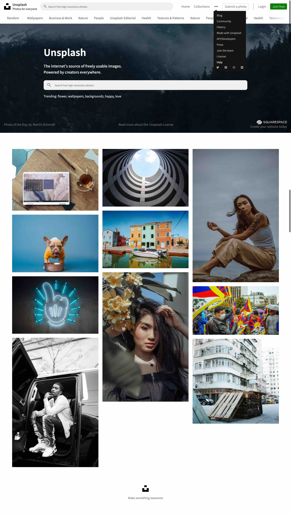
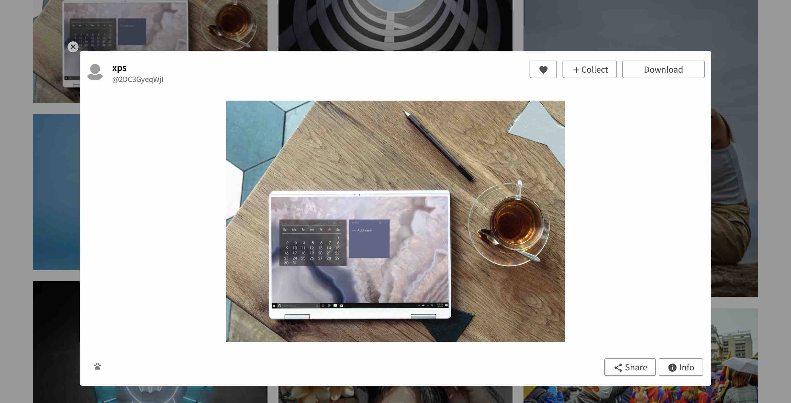
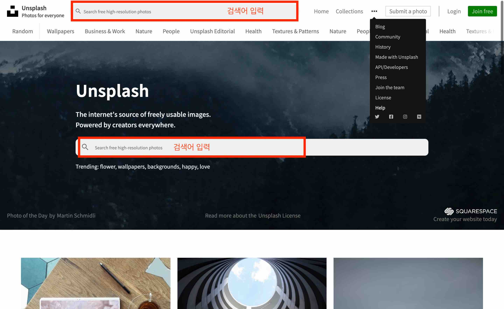
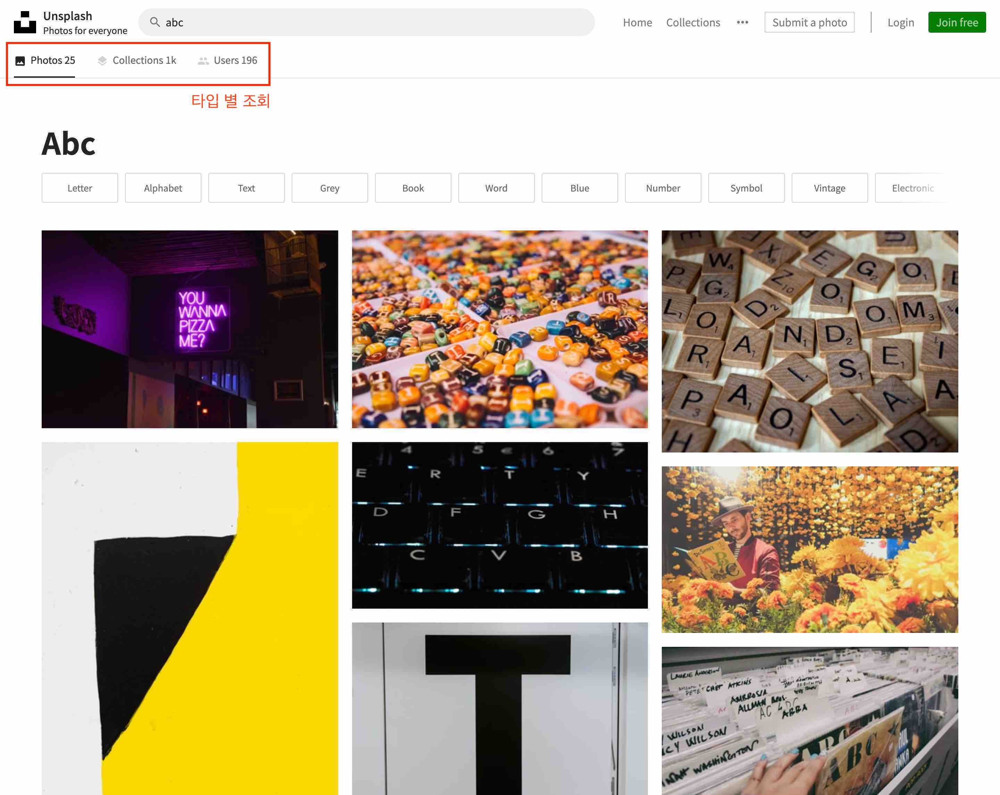

## 무료 사진 소스 제공 사이트 Unsplash 카피

👀 [[Unsplash dev api]](https://unsplash.com/developers)

**[Stack]**
- 현재 store구조 리팩토링 및 Styled-components사용으로 변환 작업 중
```
 - Unsplash에서 제공되는 dev api
 - React, React-router-dom, Scss
 - Redux, Saga, Axios
 - server 없는 SPA로, 세부 url로 세부 페이지 접속 시 404
```

**[현재 작업중인 v2] ✬✬✬**
- Redux 구조 connect HOC가 아닌 hook
- 하나로 통합된 것이 아닌, Reducer를 세분화한 store 구조
- scss 아닌 styled-components를 사용
- 필요 시 CreatePortal을 사용한 모달
- RWD (Responsive web design), flex 사용    
- 세분화된 git commit

**[구현한 Pages]** Main, PhotoDetail, Search, Collection

**[Structure]**
(v2에서 단일 파일로 구성된 구조 보완 예정)
```
    |____src
    | |____scss
    | | |____components
    | | | |_____noData.scss
    | | | |_____photoCard.scss
    | | | |_____searchBar.scss
    | | | |_____photos.scss
    | | |    . . . .
    | | |____style.scss
    | | |____pages
    | | | |_____collections.scss
    | | | |_____search.scss
    | | | |_____collectionPhotos.scss
    | | | |_____home.scss
    | | |____base
    | | | |_____reset.scss
    | | | |_____common.scss
    | | | |_____color.scss
    | |____index.js
    | |____views
    | | |____components
    | | | |____NoData.js
    | | | |____PreLoader.js
    | | | |____Toast.js
    | | | |____PhotoCard.js
    | | |   . . . .
    | | |____pages
    | | | |____NotFound.js
    | | | |____home
    | | | | |____Home.js
    | | | |____search
    | | | | |____Users.js
    | | | | |____Collections.js
    | | | | |____Search.js
    | | | |____randomPhotos
    | | | | |____RandomPhotos.js
    | | | |____collections
    | | | | |____CollectionPhotos.js
    | | | | |____Collections.js
    | |____redux
    | | |____action.js
    | | |____reducer.js
    | | |____store.js
    | | |____saga.js
    | | |____api.js
    | |____helpers
    | | |____FetchHelper.js
    | | |____HistoryHelper.js
    | | |____CommonHelper.js
    | | |____ConstsHelper.js
    | |____App.js
```

### ✨ Main
---
```
로드 시 토스트 메세지 / 드랍다운 메뉴
로드 시 로딩 애니메이션 / 그리드 레이아웃 이미지
```




### ✨ PhotoDetail
---



### ✨ Search
---


### ✨ Search Result
---


### ✨ Collections
---


**[Learned]**
- React와 api fetch, fetch 받은 데이터 display가 목적이었으며 완수
- static한 퍼블리싱 구현에서 페이지 라우팅 경험 / api fetch 처리
- Redux connect 메소드 구조를 위해 HOC 사용 경험
- 컴포넌트 단위로 나누어 재사용성을 높일 수 있는 구조 고민
- 더 나은 ux  코드 가독성을 위해 개선해 나가야 할 방향 파악